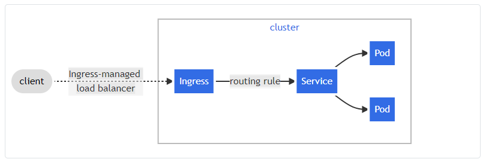

Ingress
===

Ingress exposes HTTP and HTTPS routes from outside the cluster to services within the cluster. Traffic routing is controlled by rules defined on the Ingress resource.

Here is a simple example where an Ingress sends all its traffic to one Service:



An Ingress may be configured to give Services externally-reachable URLs, load balance traffic, terminate SSL / TLS, and offer name-based virtual hosting. An Ingress controller is responsible for fulfilling the Ingress, usually with a load balancer, though it may also configure your edge router or additional frontends to help handle the traffic.

An Ingress does not expose arbitrary ports or protocols. Exposing services other than HTTP and HTTPS to the internet typically uses a service of type `Service.Type=NodePort` or `Service.Type=LoadBalancer`.

## Setting Up An Ingress Controller 

We can leverage KIND's `extraPortMapping` config option when creating a cluster to forward ports from the host to an ingress controller running on a node.

We can also setup a custom node label by using `node-labels` in the kubeadm `InitConfiguration`, to be used by the ingress controller `nodeSelector`.

1. Create a cluster
2. Deploy an Ingress controller, the following ingress controllers are known to work:
   * Ambassador
   * Contour
   * Ingress Kong
   * Ingress NGINX
  
### Create Cluster

Create a kind cluster with `extraPortMappings` and `node-labels`.

* `extraPortMappings` allow the local host to make requests to the Ingress controller over ports 80/443
* `node-labels` only allow the ingress controller to run on a specific node(s) matching the label selector

```shell
cat <<EOF | kind create cluster --config=-
kind: Cluster
apiVersion: kind.x-k8s.io/v1alpha4
nodes:
- role: control-plane
  kubeadmConfigPatches:
  - |
    kind: InitConfiguration
    nodeRegistration:
      kubeletExtraArgs:
        node-labels: "ingress-ready=true"
  extraPortMappings:
  - containerPort: 80
    hostPort: 80
    protocol: TCP
  - containerPort: 443
    hostPort: 443
    protocol: TCP
EOF
```

Create a four nodes cluster use kind
```shell
> kind create cluster -config ./four-cluster.yaml
```

### Ingress NGINX

Deploy Local
```shell
# kubectl apply -f https://raw.githubusercontent.com/kubernetes/ingress-nginx/main/deploy/static/provider/kind/deploy.yaml
❯ kubectl apply -f ./nginx/ingress-nginx-1.1.3.yaml
❯ kubectl get all -n ingress-nginx
NAME                                            READY   STATUS      RESTARTS   AGE
pod/ingress-nginx-admission-create-tl46z        0/1     Completed   0          27m
pod/ingress-nginx-admission-patch-t7mvn         0/1     Completed   1          27m
pod/ingress-nginx-controller-84bff5999d-khq8b   1/1     Running     0          27m

NAME                                         TYPE        CLUSTER-IP     EXTERNAL-IP   PORT(S)                      AGE
service/ingress-nginx-controller             NodePort    10.96.83.139   <none>        80:30639/TCP,443:31717/TCP   27m
service/ingress-nginx-controller-admission   ClusterIP   10.96.34.219   <none>        443/TCP                      27m

NAME                                       READY   UP-TO-DATE   AVAILABLE   AGE
deployment.apps/ingress-nginx-controller   1/1     1            1           27m

NAME                                                  DESIRED   CURRENT   READY   AGE
replicaset.apps/ingress-nginx-controller-84bff5999d   1         1         1       27m

NAME                                       COMPLETIONS   DURATION   AGE
job.batch/ingress-nginx-admission-create   1/1           13s        27m
job.batch/ingress-nginx-admission-patch    1/1           14s        27m
```

Status

```shell
❯ kubectl describe pod ingress-nginx  -n ingress-nginx
```

The manifests contains kind specific patches to forward the hostPorts to the ingress controller, set taint tolerations and schedule it to the custom labelled node.

Now the Ingress is all setup. Wait until is ready to process requests running:

```
kubectl wait --namespace ingress-nginx \
  --for=condition=ready pod \
  --selector=app.kubernetes.io/component=controller \
  --timeout=90s
```

## Using Ingress

[nginx/usage.yaml](nginx/usage.yaml)

```shell
> kubectl apply -f nginx/usage.yaml
> curl localhost/foo
foo
> curl localhost/bar
bar
```

## Reference
[more usage](https://github.com/kubernetes/ingress-nginx/tree/main/docs/examples)

