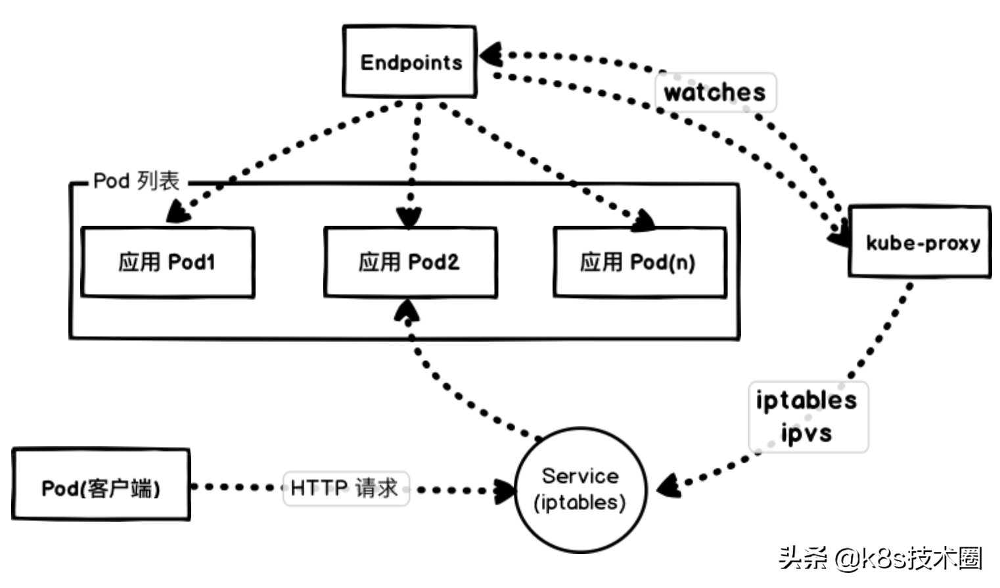
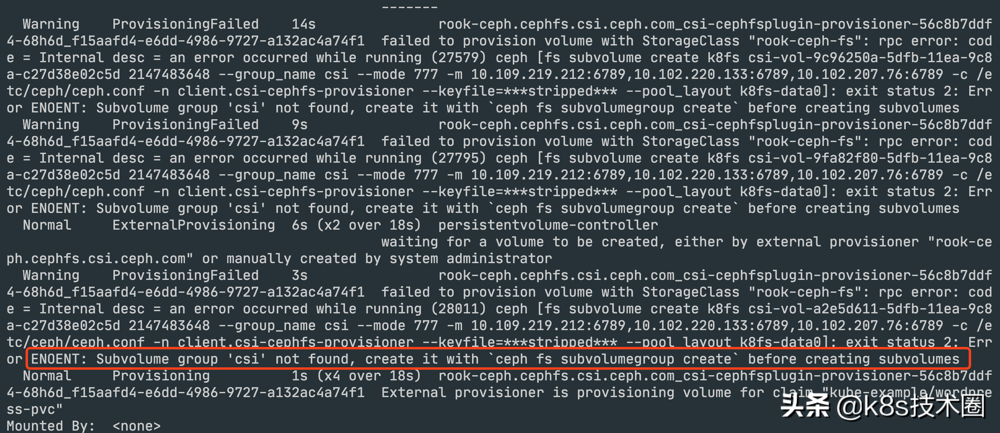

样例：WordPress
===

- [样例：WordPress](#样例wordpress)
  - [非高可用设计](#非高可用设计)
  - [高可用设计](#高可用设计)
  - [生产级别设置](#生产级别设置)
    - [避免单点故障](#避免单点故障)
    - [使用 PDB](#使用-pdb)
    - [健康检查](#健康检查)
    - [服务质量 QoS](#服务质量-qos)
      - [Guaranteed(有保证的)](#guaranteed有保证的)
      - [Burstable(不稳定的)](#burstable不稳定的)
      - [Best-Effort(尽最大努力)](#best-effort尽最大努力)
    - [资源回收策略](#资源回收策略)
    - [滚动更新](#滚动更新)
    - [零宕机](#零宕机)
    - [HPA](#hpa)
    - [安全性](#安全性)
    - [持久化](#持久化)
    - [Ingress](#ingress)

## 非高可用设计

同一 Pod 部署容器

创建上面的几个资源对象

```shell
$ kubectl apply -f ./namespace.yaml
$ kubectl apply -f ./noha/deployment.yaml
$ kubectl apply -f ./noha/service.yaml
```

接下来就是等待拉取镜像，启动 Pod

```shell

$ kubectl get pods -n kube-samples
NAME                         READY   STATUS    RESTARTS   AGE
wordpress-6c595d4595-8g58w   2/2     Running   0          2m53s

$ kubectl get svc -n kube-samples
NAME        TYPE       CLUSTER-IP     EXTERNAL-IP   PORT(S)        AGE
wordpress   NodePort   10.96.251.93   <none>        80:30656/TCP   3m40s
```

## 高可用设计

进行容器拆分，控制启动顺序，多实例部署

我们[这里](./ha/mysql.yaml)给 MySQL 应用添加了一个 Service 对象，是因为 Wordpress 应用需要来连接数据库，之前在同一个 Pod 中用 localhost 即可，现在需要通过 Service 的 DNS 形式的域名进行连接。

直接创建上面资源对象

```shell
kubectl apply -f ./ha/mysql.yaml 
```

接下来创建独立的 Wordpress 服务，对应的资源对象如下 [wordpress.yaml](ha/wordpress.yaml)

注意这里的环境变量 `WORDPRESS_DB_HOST` 的值将之前的 `localhost` 地址更改成了上面 MySQL 服务的 DNS 地址，完整的域名应该是
wordpress-mysql.kube-samples.svc.cluster.local:3306，由于这两个应该都处于同一个命名空间，所以直接简写成 wordpress-mysql:3306 也是可以的。

创建上面资源对象：

```shell
kubectl apply -f ./ha/wordpress.yaml 
```

可以看到都已经是 Running 状态了，然后我们需要怎么来验证呢？是不是我们能想到的就是去访问下我们的 Wordpress 服务就可以了，我们这里还是使用的一个 NodePort 类型的 Service 来暴露服务：

```
$ kubectl get svc -l app=wordpress -n kube-samples
wordpress         NodePort    10.96.243.26   <none>        80:32607/TCP   26s
wordpress-mysql   ClusterIP   10.96.167.49   <none>        3306/TCP       51s
```
可以看到 wordpress 服务产生了一个 32607 的端口，现在我们就可以通过 http://<任意节点的NodeIP>:32607 访问我们的应用了


## 生产级别设置

现在 Wodpress 应用已经部署成功了，那么就万事大吉了吗？如果我们的网站访问量突然变大了怎么办，如果我们要更新我们的镜像该怎么办？所以要保证我们的网站能够非常稳定的提供服务，我们做得还不够，我们可以通过做些什么事情来提高网站的稳定性呢？

### 避免单点故障

为什么会有单点故障的问题呢？我们不是部署了多个副本的 Wordpress 应用吗？当我们设置 replicas=1 的时候肯定会存在单点故障问题，如果大于 1 但是所有副本都调度到了同一个节点的是不是同样就会存在单点问题了，这个节点挂了所有副本就都挂了，所以我们不仅需要设置多个副本数量，还需要让这些副本调度到不同的节点上，来打散避免单点故障，这个利用 Pod 反亲和性来实现了，我们可以加上如下所示的配置：

```yaml
affinity:
  podAntiAffinity:
    preferredDuringSchedulingIgnoredDuringExecution:  # 软策略
    - weight: 1
      podAffinityTerm:
        topologyKey: kubernetes.io/hostname
        labelSelector:
          matchExpressions:
          - key: app
            operator: In
            values:
            - wordpress
```

这里的意思就是如果一个节点上面有 app=wordpress 这样的 Pod 的话，那么我们的 Pod 就尽可能别调度到这个节点上面来，因为我们这里的节点并不多，所以我使用的是软策略，因为如果使用硬策略的话，如果应用副本数超过了节点数就必然会有 Pod 调度不成功，如果你线上节点非常多的话（节点数大于 Pod 副本数），建议使用硬策略，更新后我们可以查看下 3 个副本被分散在了不同的节点上。

创建资源

```shell
$ kubectl apply -f ./robust/mysql.yaml
$ kubectl apply -f ./robust/wordpress.yaml
```


### 使用 PDB

有些时候线上的某些节点需要做一些维护操作，比如要升级内核，这个时候我们就需要将要维护的节点进行驱逐操作，驱逐节点首先是将节点设置为不可调度，这样可以避免有新的 Pod 调度上来，然后将该节点上的 Pod 全部删除，ReplicaSet 控制器检测到 Pod 数量减少了就会重新创建一个新的 Pod，调度到其他节点上面的，这个过程是先删除，再创建，并非是滚动更新，因此更新过程中，如果一个服务的所有副本都在被驱逐的节点上，则可能导致该服务不可用。

如果服务本身存在单点故障，所有副本都在同一个节点，驱逐的时候肯定就会造成服务不可用了，这种情况我们使用上面的反亲和性和多副本就可以解决这个问题。但是如果我们的服务本身就被打散在多个节点上，这些节点如果都被同时驱逐的话，那么这个服务的所有实例都会被同时删除，这个时候也会造成服务不可用了，这种情况下我们可以通过配置 PDB（PodDisruptionBudget）对象来避免所有副本同时被删除，比如我们可以设置在驱逐的时候 wordpress 应用最多只有一个副本不可用，其实就相当于逐个删除并在其它节点上重建：（pdb.yaml）

```shell
apiVersion: policy/v1beta1
kind: PodDisruptionBudget
metadata:
  name: wordpress-pdb
  namespace: kube-samples
spec:
  maxUnavailable: 1
  selector:
    matchLabels:
      app: wordpress
      tier: frontend
```

直接创建这个资源对象

```shell
##
kubectl apply -f ./robust/pdb.yaml
##
kubectl get pdb -n kube-samples

```

### 健康检查

我们的应用现在还有一个非常重要的功能没有提供，那就是健康检查，我们知道健康检查是提高应用健壮性非常重要的手段，当我们检测到应用不健康的时候我们希望可以自动重启容器，当应用还没有准备好的时候我们也希望暂时不要对外提供服务，所以我们需要添加我们前面经常提到的 liveness probe 和 rediness probe 两个健康检测探针，检查探针的方式有很多，我们这里当然可以认为如果容器的 80 端口可以成功访问那么就是健康的，对于一般的应用提供一个健康检查的 URL 会更好，这里我们添加一个如下所示的可读性探针，为什么不添加存活性探针呢？这里其实是考虑到线上错误排查的一个问题，如果当我们的应用出现了问题，然后就自动重启去掩盖错误的话，可能这个错误就会被永远忽略掉了，所以其实这是一个折衷的做法，不使用存活性探针，而是结合监控报警，保留错误现场，方便错误排查，但是可读写探针是一定需要添加的：

```shell
readinessProbe:
  tcpSocket:
    port: 80
  initialDelaySeconds: 5
  periodSeconds: 5
```

增加上面的探针，每 5s 检测一次应用是否可读，这样只有当 readinessProbe 探针检测成功后才表示准备好接收流量了，这个时候才会更新 Service 的 Endpoints 对象


### 服务质量 QoS

QoS 是 Quality of Service 的缩写，即服务质量。为了实现资源被有效调度和分配的同时提高资源利用率，Kubernetes 针对不同服务质量的预期，通过 QoS 来对 Pod 进行服务质量管理。对于一个 Pod 来说，服务质量体现在两个具体的指标：CPU 和内存。当节点上内存资源紧张时，Kubernetes 会根据预先设置的不同 QoS 类别进行相应处理。

QoS 主要分为 Guaranteed、Burstable 和 Best-Effort三类，优先级从高到低。我们先分别来介绍下这三种服务类型的定义。

#### Guaranteed(有保证的)

属于该级别的 Pod 有以下两种

* Pod 中的所有容器都且仅设置了 CPU 和内存的 limits
* Pod 中的所有容器都设置了 CPU 和内存的 requests 和 limits ，且单个容器内的requests==limits（requests不等于0）

Pod 中的所有容器都且仅设置了 limits，如下所示:

```yaml
containers:
  - name: foo
    resources:
      limits:
        cpu: 10m
        memory: 1Gi
  - name: bar
    resources:
      limits:
        cpu: 100m
        memory: 100Mi
```

Pod 中的所有容器都设置了 requests 和 limits，且单个容器内的 requests==limits 的情况：

```yaml
containers:
  - name: foo
    resources:
      limits:
        cpu: 10m
        memory: 1Gi
      requests:
        cpu: 10m
        memory: 1Gi
  - name: bar
    resources:
      limits:
        cpu: 100m
        memory: 100Mi
      requests:
        cpu: 100m
        memory: 100Mi
```

容器 foo 和 bar 内 resources 的 requests 和 limits 均相等，该 Pod 的 QoS 级别属于 Guaranteed。

#### Burstable(不稳定的)

Pod 中只要有一个容器的 requests 和 limits 的设置不相同，那么该 Pod 的 QoS 即为 Burstable。如下所示容器 foo 指定了 resource，而容器 bar 未指定：

```yaml
containers:
  - name: foo
    resources:
      limits:
        cpu: 10m
        memory: 1Gi
      requests:
        cpu: 10m
        memory: 1Gi
  - name: bar
```

容器 foo 设置了内存 limits，而容器 bar 设置了CPU limits：

```yaml
containers:
  - name: foo
    resources:
      limits:
        memory: 1Gi
  - name: bar
    resources:
      limits:
        cpu: 100m
```

需要注意的是如果容器指定了 requests 而未指定 limits，则 limits 的值等于节点资源的最大值，如果容器指定了 limits 而未指定 requests，则 requests 的值等于 limits。

#### Best-Effort(尽最大努力)

如果 Pod 中所有容器的 resources 均未设置 requests 与 limits，该 Pod 的 QoS 即为 Best-Effort。如下所示容器 foo 和容器 bar 均未设置requests 和 limits：

```yaml
containers:
  - name: foo
    resources:
  - name: bar
    resources:
```

### 资源回收策略

Kubernetes 通过 CGroup 给 Pod设置 QoS 级别，当资源不足时会优先 kill 掉优先级低的 Pod，在实际使用过程中，通过 OOM 分数值来实现，OOM 分数值范围为 0-1000，OOM 分数值根据 OOM_ADJ参数计算得出。

对于 Guaranteed 级别的 Pod，OOM_ADJ 参数设置成了-998，对于 Best-Effort 级别的 Pod，OOM_ADJ 参数设置成了1000，对于 Burstable 级别的 Pod，OOM_ADJ 参数取值从 2 到 999。

QoS Pods 被 kill 掉的场景和顺序如下所示：

* Best-Effort Pods：系统用完了全部内存时，该类型 Pods 会最先被 kill 掉
* Burstable Pods：系统用完了全部内存，且没有 Best-Effort 类型的容器可以被 kill 时，该类型的 Pods 会被 kill 掉
* Guaranteed Pods：系统用完了全部内存，且没有 Burstable 与 Best-Effort 类型的容器可以被 kill 时，该类型的 pods 会被 kill 掉

所以如果资源充足，可将 QoS Pods 类型设置为 Guaranteed，用计算资源换业务性能和稳定性，减少排查问题时间和成本。如果想更好的提高资源利用率，业务服务可以设置为 Guaranteed，而其他服务根据重要程度可分别设置为 Burstable 或 Best-Effort，这就要看具体的场景了。

比如我们这里如果想要尽可能提高 Wordpress 应用的稳定性，我们可以将其设置为 Guaranteed 类型的 Pod，我们现在没有设置 resources 资源，所以现在是 Best-Effort 类型的 Pod。

现在如果要想给应用设置资源大小，就又有一个问题了，应该如何设置合适的资源大小呢？其实这就需要我们对自己的应用非常了解才行了，一般情况下我们可以先不设置资源，然后可以根据我们的应用的并发和访问量来进行压力测试，基本上可以大概计算出应用的资源使用量，我们这里可以使用 Apache Bench（AB Test） 或者 Fortio（Istio 测试工具） 这样的测试工具来测试，我们这里使用 Fortio 这个测试工具，比如每秒 1000 个请求和 8 个并发的连接的测试命令如下所示：

```shell
$ fortio load -a -c 8 -qps 1000 -t 60s "http://k8s.qikqiak.com:30012"
Starting at 1000 qps with 8 thread(s) [gomax 2] for 1m0s : 7500 calls each (total 60000)
Ended after 1m0.687224615s : 5005 calls. qps=82.472
Aggregated Sleep Time : count 5005 avg -27.128368 +/- 16 min -55.964246789 max -0.050576982 sum -135777.482
[......]
Sockets used: 53 (for perfect keepalive, would be 8)
Code 200 : 5005 (100.0 %)
Response Header Sizes : count 5005 avg 292.17083 +/- 1.793 min 292 max 311 sum 1462315
Response Body/Total Sizes : count 5005 avg 27641.171 +/- 1.793 min 27641 max 27660 sum 138344060
Saved result to data/2020-02-15-125121_Fortio.json (graph link)
All done 5005 calls 95.872 ms avg, 82.5 qps
```

也可以通过浏览器查看到最终测试结果

在测试期间我们可以用如下所示的命令查看应用的资源使用情况：

```shell
$ kubectl top pods -l app=wordpress -n kube-samples
NAME                              CPU(cores)   MEMORY(bytes)
wordpress-5cc66f986b-2jv7h        569m         72Mi
wordpress-5cc66f986b-nf79l        997m         71Mi
wordpress-d4c885d5d-gtvhd         895m         87Mi
```

我们可以看到内存基本上都是处于 100Mi 以内，而 CPU 消耗就非常大了，但是由于 CPU 是可压缩资源，也就是说超过了限制应用也不会挂掉的，只是会变慢而已。所以我们这里可以给 Wordpress 应用添加如下所示的资源配置，如果你集群资源足够的话可以适当多分配一些资源：

```yaml
resources:
  limits:
    cpu: 200m
    memory: 100Mi
  requests:
    cpu: 200m
    memory: 100Mi
```

### 滚动更新

Deployment 控制器默认的就是滚动更新的更新策略，该策略可以在任何时间点更新应用的时候保证某些实例依然可以正常运行来防止应用 down 掉，当新部署的 Pod 启动并可以处理流量之后，才会去杀掉旧的 Pod。在使用过程中我们还可以指定 Kubernetes 在更新期间如何处理多个副本的切换方式，比如我们有一个3副本的应用，在更新的过程中是否应该立即创建这3个新的 Pod 并等待他们全部启动，或者杀掉一个之外的所有旧的 Pod，或者还是要一个一个的 Pod 进行替换？

如果我们从旧版本到新版本进行滚动更新，只是简单的通过输出显示来判断哪些 Pod 是存活并准备就绪的，那么这个滚动更新的行为看上去肯定就是有效的，但是往往实际情况就是从旧版本到新版本的切换的过程并不总是十分顺畅的，应用程序很有可能会丢弃掉某些客户端的请求。比如我们在 Wordpress 应用中添加上如下的滚动更新策略，随便更改以下 Pod Template 中的参数，比如容器名更改为 blog：

```yaml
strategy:
  type: RollingUpdate
  rollingUpdate:
    maxSurge: 1
    maxUnavailable: 0
```

然后更新应用，同时用 Fortio 工具在滚动更新过程中来测试应用是否可用：

```shell
$ kubectl apply -f wordpress.yaml
$ fortio load -a -c 8 -qps 1000 -t 60s "http://k8s.qikqiak.com:30012"
Starting at 1000 qps with 8 thread(s) [gomax 2] for 1m0s : 7500 calls each (total 60000)
Ended after 1m0.006243654s : 5485 calls. qps=91.407
Aggregated Sleep Time : count 5485 avg -17.626081 +/- 15 min -54.753398956 max 0.000709054 sum -96679.0518
[...]
Code 200 : 5463 (99.6 %)
Code 502 : 20 (0.4 %)
Response Header Sizes : count 5485 avg 213.14166 +/- 13.53 min 0 max 214 sum 1169082
Response Body/Total Sizes : count 5485 avg 823.18651 +/- 44.41 min 0 max 826 sum 4515178
[...]
```

从上面的输出可以看出有部分请求处理失败了（502），要弄清楚失败的原因就需要弄明白当应用在滚动更新期间重新路由流量时，从旧的 Pod 实例到新的实例究竟会发生什么，首先让我们先看看 Kubernetes 是如何管理工作负载连接的。


失败原因:

我们这里通过 NodePort 去访问应用，实际上也是通过每个节点上面的 kube-proxy 通过更新 iptables 规则来实现的。



Kubernetes 会根据 Pods 的状态去更新 Endpoints 对象，这样就可以保证 Endpoints 中包含的都是准备好处理请求的 Pod。一旦新的 Pod 处于活动状态并准备就绪后，Kubernetes 就将会停止旧的 Pod，从而将 Pod 的状态更新为 “Terminating”，然后从 Endpoints 对象中移除，并且发送一个 SIGTERM 信号给 Pod 的主进程。SIGTERM 信号就会让容器以正常的方式关闭，并且不接受任何新的连接。Pod 从 Endpoints 对象中被移除后，前面的负载均衡器就会将流量路由到其他（新的）Pod 中去。因为在负载均衡器注意到变更并更新其配置之前，终止信号就会去停用 Pod，而这个重新配置过程又是异步发生的，并不能保证正确的顺序，所以就可能导致很少的请求会被路由到已经终止的 Pod 上去了，也就出现了上面我们说的情况。

### 零宕机

那么如何增强我们的应用程序以实现真正的零宕机迁移更新呢？

首先，要实现这个目标的先决条件是我们的容器要正确处理终止信号，在 SIGTERM 信号上实现优雅关闭。下一步需要添加 readiness 可读探针，来检查我们的应用程序是否已经准备好来处理流量了。为了解决 Pod 停止的时候不会阻塞并等到负载均衡器重新配置的问题，我们还需要使用 preStop 这个生命周期的钩子，在容器终止之前调用该钩子。

生命周期钩子函数是同步的，所以必须在将最终停止信号发送到容器之前完成，在我们的示例中，我们使用该钩子简单的等待，然后 SIGTERM 信号将停止应用程序进程。同时，Kubernetes 将从 Endpoints 对象中删除该 Pod，所以该 Pod 将会从我们的负载均衡器中排除，基本上来说我们的生命周期钩子函数等待的时间可以确保在应用程序停止之前重新配置负载均衡器：

```yaml
readinessProbe:
  # ...
lifecycle:
  preStop:
    exec:
      command: ["/bin/bash", "-c", "sleep 20"]
```

我们这里使用 preStop 设置了一个 20s 的宽限期，Pod 在真正销毁前会先 sleep 等待 20s，这就相当于留了时间给 Endpoints 控制器和 kube-proxy 更新去 Endpoints 对象和转发规则，这段时间 Pod 虽然处于 Terminating 状态，即便在转发规则更新完全之前有请求被转发到这个 Terminating 的 Pod，依然可以被正常处理，因为它还在 sleep，没有被真正销毁。

现在，当我们去查看滚动更新期间的 Pod 行为时，我们将看到正在终止的 Pod 处于 Terminating 状态，但是在等待时间结束之前不会关闭的，如果我们使用 Fortio 重新测试下，则会看到零失败请求的理想状态。

### HPA

现在应用是固定的3个副本，但是往往在生产环境流量是不可控的，很有可能一次活动就会有大量的流量，3个副本很有可能抗不住大量的用户请求，这个时候我们就希望能够自动对 Pod 进行伸缩，直接使用前面我们学习的 HPA 这个资源对象就可以满足我们的需求了。

直接使用kubectl autoscale命令来创建一个 HPA 对象

```shell
$ kubectl autoscale deployment wordpress --namespace kube-samples --cpu-percent=20 --min=3 --max=6
horizontalpodautoscaler.autoscaling/hpa-demo autoscaled
$ kubectl get hpa -n kube-samples
NAME        REFERENCE              TARGETS         MINPODS   MAXPODS   REPLICAS   AGE
wordpress   Deployment/wordpress   <unknown>/20%   3         6         0          13s
```

此命令创建了一个关联资源 wordpress 的 HPA，最小的 Pod 副本数为3，最大为6。HPA 会根据设定的 cpu 使用率（20%）动态的增加或者减少 Pod 数量。同样，使用上面的 Fortio 工具来进行压测一次，看下能否进行自动的扩缩容：

```shell
$ fortio load -a -c 8 -qps 1000 -t 60s "http://k8s.qikqiak.com:30012"
```

在压测的过程中我们可以看到 HPA 的状态变化以及 Pod 数量也变成了6个：

```shell
$ kubectl get hpa -n kube-samples
NAME        REFERENCE              TARGETS   MINPODS   MAXPODS   REPLICAS   AGE
wordpress   Deployment/wordpress   98%/20%   3         6         6          2m40s
$ kubectl get pods -n kube-samples                
NAME                              READY   STATUS    RESTARTS   AGE
wordpress-79d756cbc8-f6kfm        1/1     Running   0          21m
wordpress-79d756cbc8-kspch        1/1     Running   0          32s
wordpress-79d756cbc8-sf5rm        1/1     Running   0          32s
wordpress-79d756cbc8-tsjmf        1/1     Running   0          20m
wordpress-79d756cbc8-v9p7n        1/1     Running   0          32s
wordpress-79d756cbc8-z4wpp        1/1     Running   0          21m
wordpress-mysql-5756ccc8b-zqstp   1/1     Running   0          3d19h
```

当压测停止以后正常5分钟后就会自动进行缩容，变成最小的3个 Pod 副本。

### 安全性

安全性这个和具体的业务应用有关系，比如我们这里的 Wordpress 也就是数据库的密码属于比较私密的信息，我们可以使用 Kubernetes 中的 Secret 资源对象来存储比较私密的信息：

```shell
$ kubectl create secret generic wordpress-db-pwd --from-literal=dbpwd=wordpress -n kube-samples
secret/wordpress-db-pwd created
```

然后将 Deployment 资源对象中的数据库密码环境变量通过 Secret 对象读取：

```yaml
env:
- name: WORDPRESS_DB_HOST
  value: wordpress-mysql:3306
- name: WORDPRESS_DB_USER
  value: wordpress
- name: WORDPRESS_DB_PASSWORD
  valueFrom:
    secretKeyRef:
      name: wordpress-db-pwd
      key: dbpwd
```

这样我们就不会在 YAML 文件中看到明文的数据库密码了，当然安全性都是相对的，Secret 资源对象也只是简单的将密码做了一次 Base64 编码而已，对于一些特殊场景安全性要求非常高的应用，就需要使用其他功能更加强大的密码系统来进行管理了，比如 Vault。

### 持久化

现在还有一个比较大的问题就是我们的数据还没有做持久化，MySQL 数据库没有做，Wordpress 应用本身也没有做，这显然不是一个合格的线上应用。这里我们直接使用前面章节中创建的 rook-ceph-block 这个 StorageClass 来创建我们的数据库存储后端：(pvc.yaml)

```yaml
apiVersion: v1
kind: PersistentVolumeClaim
metadata:
  name: mysql-pvc
  namespace: kube-samples
  labels:
    app: wordpress
spec:
  storageClassName: rook-ceph-block
  accessModes:
  - ReadWriteOnce
  resources:
    requests:
      storage: 20Gi
```

但是由于 Wordpress 应用是多个副本，所以需要同时在多个节点进行读写，也就是 accessModes 需要 ReadWriteMany 模式，而 Ceph RBD 模式是不支持 RWM 的，所以需要使用 CephFS，首先需要在 Ceph 中创建一个 Filesystem，这里我们可以通过 Rook 的 CephFilesystem 资源对象创建，如下所示：


```yaml
apiVersion: ceph.rook.io/v1
kind: CephFilesystem
metadata:
  name: myfs
  namespace: rook-ceph
spec:
  metadataPool:
    replicated:
      size: 3
  dataPools:
  - replicated:
      size: 3
  metadataServer:
    activeCount: 1
    activeStandby: true
```

创建完成后还会生成一个名为 myfs-data0 的存储池，也会自动生成两个 MDS 的 Pod 服务：

```shell
$ kubectl get pods -n rook-ceph | grep myfs
rook-ceph-mds-myfs-a-7948557994-44c4f                  1/1     Running     0          11m
rook-ceph-mds-myfs-b-5976b868cc-gl86g                  1/1     Running     0          11m
```

这个时候就可以创建我们的 StorageClass 对象了：

```yaml
apiVersion: storage.k8s.io/v1
kind: StorageClass
metadata:
  name: csi-cephfs
provisioner: rook-ceph.cephfs.csi.ceph.com
parameters:
  clusterID: rook-ceph
  # 上面创建的 CephFS 文件系统名称
  fsName: myfs
  # 自动生成的
  pool: myfs-data0 
  # Root path of an existing CephFS volume
  # Required for provisionVolume: "false"
  # rootPath: /absolute/path
  # The secrets contain Ceph admin credentials. These are generated automatically by the operator
  # in the same namespace as the cluster.
  csi.storage.k8s.io/provisioner-secret-name: rook-csi-cephfs-provisioner
  csi.storage.k8s.io/provisioner-secret-namespace: rook-ceph
  csi.storage.k8s.io/controller-expand-secret-name: rook-csi-cephfs-provisioner
  csi.storage.k8s.io/controller-expand-secret-namespace: rook-ceph
  csi.storage.k8s.io/node-stage-secret-name: rook-csi-cephfs-node
  csi.storage.k8s.io/node-stage-secret-namespace: rook-ceph

reclaimPolicy: Retain
allowVolumeExpansion: true
mountOptions:
```

同样直接创建上面的 StorageClass 资源对象即可，现在 Wordpress 的 PVC 对象使用我们这里的 csi-cephfs 这个 StorageClass 对象：

```yaml
apiVersion: v1
kind: PersistentVolumeClaim
metadata:
  name: wordpress-pvc
  namespace: kube-samples
  labels:
    app: wordpress
spec:
  storageClassName: csi-cephfs
  accessModes:
  - ReadWriteMany  # 由于是多个Pod所以要用 RWM
  resources:
    requests:
      storage: 2Gi
```

直接创建上面的资源对象：

```shell
$ kubectl get pvc -n kube-samples
NAME            STATUS   VOLUME                                     CAPACITY   ACCESS MODES   STORAGECLASS      AGE
mysql-pvc       Bound    pvc-93e0b186-da20-4e5e-8414-8cc73e00bf64   20Gi       RWO            rook-ceph-block   45m
wordpress-pvc   Bound    pvc-87675c58-407a-4b7e-be9d-0733f67c4835   2Gi
```

在使用 CephFS 的过程中遇到了上面的 PVC 一直处于 Pending 状态，然后 describe 后发现有如下所示的错误信息：



从错误信息上面来看是在通过 StorageClass 去自动创建 PV 的时候就出现了问题，所以我们需要去检查 CSI 的 attach 阶段：

```shell
$ kubectl get pods -n rook-ceph |grep csi-cephfsplugin-provisioner
csi-cephfsplugin-provisioner-56c8b7ddf4-4s7fd          4/4     Running     0          18m
csi-cephfsplugin-provisioner-56c8b7ddf4-55sg6          4/4     Running     0          39m
```

然后查看这两个 Pod 的日志发现都是类似于下面的错误：

```shell
I0304 10:04:04.823171       1 leaderelection.go:246] failed to acquire lease rook-ceph/rook-ceph-cephfs-csi-ceph-com
I0304 10:04:14.344109       1 leaderelection.go:350] lock is held by csi-cephfsplugin-provisioner-56c8b7ddf4-rq4t6 and has not yet expired
```

因为我们这里有两个副本的 Provisioner，正常应该是有一个提供服务，另外一个作为备用的，通过获取到分布式锁来表示当前的 Pod 是否是 leader，这里两个 Pod 都没获取到，应该就是出现了通信问题，然后将两个 Pod 都重建后，其中一个 Pod 便获取到了 lease 对象，然后 PVC 也成功绑定上了 PV。

可以看到上面的 PVC 已经自动绑定到 PV 上面去了，这个就是上面的 StorageClass 完成的工作。然后在 Wordpress 应用上添加对 /var/www/html 目录的挂载声明：

```yaml
  volumeMounts:
  - name: wordpress-data
    mountPath: /var/www/html
volumes:
- name: wordpress-data
  persistentVolumeClaim:
    claimName: wordpress-pvc
```

在 MySQL 应用上添加对 /var/lib/mysql 目录的挂载声明：

```yaml
  volumeMounts:
  - name: mysql-data
    mountPath: /var/lib/mysql
volumes:
- name: mysql-data
  persistentVolumeClaim:
    claimName: mysql-pvc
```

重新更新应用即可，在更新的过程中发现 MySQL 启动失败了，报如下所示的错误：

```shell
.....
[ERROR] --initialize specified but the data directory has files in it. Aborting.

```

意思就是 /var/lib/mysql 目录下面已经有数据了，当然可以清空该目录然后重新创建即可，这里可能是 mysql:5.7 这个镜像的 BUG，所以我们更改成 mysql:5.6 这个镜像，去掉之前添加的一个认证参数：

```yaml
containers:
- image: mysql:5.6
  name: mysql
  imagePullPolicy: IfNotPresent
  args:
  - --character-set-server=utf8mb4
  - --collation-server=utf8mb4_unicode_ci
```

重新更新就可以正常启动了。

### Ingress

对于一个线上的应用对外暴露服务用一个域名显然是更加合适的，上面我们使用的 NodePort 类型的服务不适合用于线上生产环境，这里我们通过 Ingress 对象来暴露服务，由于我们使用的是 Traefik2.1 这个 Ingress 控制器，所以通过 IngressRoute 对象来暴露我们的服务，此外为了安全我们还使用了 ACME 来自动获取 https 的证书，并且通过一个中间件将 http 强制跳转到 https 服务：([ingressroute.yaml](robust/ingressroute.yaml))

```yaml
apiVersion: traefik.containo.us/v1alpha1
kind: IngressRoute
metadata:
  name: wordpress-https
  namespace: kube-samples
spec:
  entryPoints:
    - websecure
  routes:
  - match: Host(`wordpress.qikqiak.com`)
    kind: Rule
    services:
    - name: wordpress
      port: 80
  tls:
    certResolver: ali
    domains:
    - main: "*.qikqiak.com"
---
apiVersion: traefik.containo.us/v1alpha1
kind: Middleware
metadata:
  name: redirect-https
  namespace: kube-samples
spec:
  redirectScheme:
    scheme: https
---
apiVersion: traefik.containo.us/v1alpha1
kind: IngressRoute
metadata:
  name: wordpress-http
  namespace: kube-samples
spec:
  entryPoints:
    - web
  routes:
  - match: Host(`wordpress.qikqiak.com`)
    kind: Rule
    services:
    - name: wordpress
      port: 80
    middlewares: 
    - name: redirect-https
```

直接创建上面的资源对象即可：

```shell
$ kubectl apply -f ingressroute.yaml 
ingressroute.traefik.containo.us/wordpress-https created
middleware.traefik.containo.us/redirect-https created
ingressroute.traefik.containo.us/wordpress-http created
```

然后对域名 wordpress.qikqiak.com 加上对应的 DNS 解析即可正常访问了，这样即使我们的数据库或者 Wordpress 应用挂掉了也不会丢失数据了，到这里就完成了我们一个生产级别应用的部署，虽然应用本身很简单，但是如果真的要部署到生产环境我们需要关注的内容就比较多了，当然对于线上应用除了上面我们提到的还有很多值得我们关注的地方，比如监控报警、日志收集等方面都是我们关注的层面，这些在后面的课程中我们再慢慢去了解。


