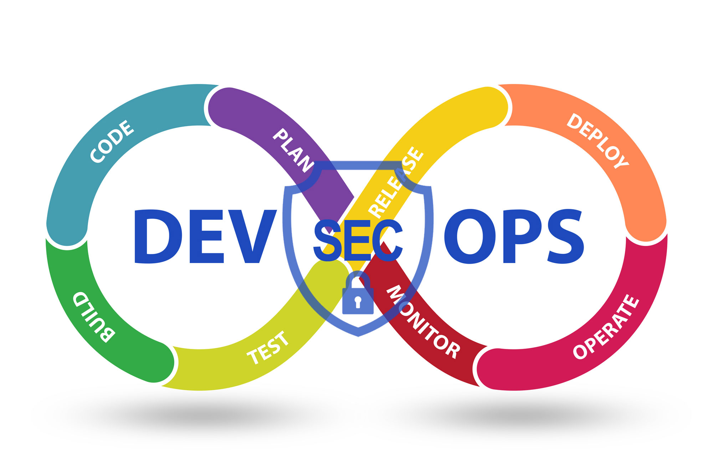

第一章：K8s 集群部署与安全配置
===

- K8s安全运维概述
- 部署一套完整的K8s高可用集群
- CIS 安全基准介绍与K8s安全基准工具kube-bench 
- Ingress 配置证书
- 网络策略控制集群内部网络通信

## K8s 安全运维概述

- 安全运维的重要性
- SecDevOps
- K8s提供的安全机制
- K8s安全运维实践思路

### 安全运维的重要性

- 万物互联，安全为基，企业的网络安全不可小视
- 服务器被黑事件频发
- 公司重要数据资产在运维手中

### SecDevOps

SecDevOps 与 DevOps 相似，是一种哲学，鼓励运维人员、开发人员、测试人员和安全人员进行更高水水平协作，将信息安全被放在事前考虑，将安全性注入自动化流程中，以确保整个产品周期内的信息安全。



### K8s 提供的安全机制

为了保证集群以及容器应用的安全，Kubernetes 提供了多种安全机制，限制容器的行为，减少容器和集群的攻击面，保证整个系统的安全性。

- 集群安全：TLS证书认证、RBAC
- Security Context：限制容器的行为，例如只读文件系统、特权、运行用户等
- Pod Security Policy：集群级的Pod 安全策略，自动为集群内的 Pod 配置安全策略
- Sysctls：允许容器设置内核参数
- AppArmor：限制容器中应用对资源的访问权限
- Seccomp：限制容器内进程的系统调用
- Network Policies：控制集群中网络通信

### K8s 安全运维实践思路

1. 构建阶段
   - 小的基础镜像
   - 避免非必须组件的添加
   - 使用最新镜像
   - 镜像安全扫描，识别安全漏洞
2. 部署阶段
   - 使用命名空间隔离敏感的工作负载
   - 使用网络策略来控制 Pod 和集群间的流量
   - 评估容器使用的特权
   - 评估镜像来源
   - 将镜像扫描控制到部署阶段
   - 启动 RBAC 授权
3. 运行阶段
   - 将漏洞扫描扩展到正在运行的部署
   - 配置 Pod 安全上下文
   - 现在不必要或不安全的网络通信
4. 基础设施安全
   - 保持 K8s 最新版本更新
   - 安全地配置 Kubernetes API Server
   - ETCD 安全
   - kubelet 安全
5. 实施 K8s 的安全
   - 将安全更早的嵌入到容器的生命周期中
   - 使用 Kubernetes 内置安全控制机制来降低运营风险
   - 按优先级进行修复工作


## 部署一套完整的K8s高可用集群

- [高可用集群部署](../../../c2-orchestration&manegement/scheduling&orchestration/k8s/cluster/ha-cluster-topology.md)
  - [实战一](../../../c2-orchestration&manegement/scheduling&orchestration/k8s/cluster/installing-ha-cluster-centos.md)

## CIS 安全基准介绍与 K8s 安全基准工具 kube-bench 

- CIS 安全基准
- K8s 安全基准工具 kube-bench

### CIS 安全基准

互联网安全中心 CIS（Center for Internet Security），全球一非盈利组织，致力于为互联网提供免费的安全防御解决方案。

官网：https://www.cisecurity.org/

Kubernetes CIS 安全基准：https://www.cisecurity.org/benchmark/kubernets/

WorkBench Account: caojiaqing@aliyun.com KtyXuGFMzYH@3&4

### CIS 基准测试工具 kube-bench


[CIS Kubernetes Benchmark Download](https://workbench.cisecurity.org/benchmarks?q=kubernetes&sortBy=version&type=desc)

kube-bench 容器安全厂商 Aquq 推出的工具， 以 CIS K8s 安全基准为标准，用以检查 K8s 是否安全部署。

检查内容主要包括：不安全的配置参数，敏感的文件权限，不安全的账户及公开的不安全端口等

项目地址：https://github.com/aquasecurity/kube-bench

```bash
$ wget https://github.com/aquasecurity/kube-bench/releases/download/v0.6.9/kube-bench_0.6.9_linux_amd64.tar.gz
$ tar zxvf kube-bench_0.6.9_linux_amd64.tar.gz 
sudo mkdir /etc/kube-bench
sudo mv  kube-bench /user/bin
sudo mv cfg /etc/kube-bench/cfg
$ kube-bench --help
```


### CIS 基准测试工具 kube-bench 使用

使用 kube-bench run 进行测试，该指令有以下常用参数：

- `-s`, `--targets` 指定要基础测试的目标，这个目标需要匹配cfg/<version>中的
文件名称，已有目标：`master, controlplane, node, etcd, policies`
- `--version`：指定k8s版本，如果未指定会自动检测
- `--benchmark`：手动指定CIS基准版本，不能与`--version`一起使用

[kube-bench 对 Kubernetes 版本支持](https://github.com/aquasecurity/kube-bench/blob/main/docs/platforms.md#cis-kubernetes-benchmark-support)

## Ingress 配置证书

- Ingress 是什么
- HTTPS 重要性
- 将一个项目对外暴露 HTTPS 访问

### Ingress 是什么

- Ingress：K8s 中的一个抽象资源，给管理员
提供一个暴露应用的入口定义方法。
- Ingress Controller：根据 Ingress 生成具体
的路由规则，并对Pod负载均衡器。


### HTTPS 重要性

HTTPS 是安全的 HTTP，HTTP 协议中的内容都是明文传输，HTTPS 的目的是将这
些内容加密，确保信息传输安全。最后一个字母 S 指的是 SSL/TLS 协议，它位于
HTTP 协议与 TCP/IP 协议中间。

HTTPS优势：
1. 加密隐私数据：防止您访客的隐私信息(账号、地址、手机号等)被劫持或窃取。
2. 安全身份认证：验证网站的真实性，防止钓鱼网站。 
3. 防止网页篡改：防止数据在传输过程中被篡改，保护用户体验。 
4. 地址栏安全锁：地址栏头部的“锁”型图标，提高用户信任度。 
5. 提高SEO排名：提高搜索排名顺序，为企业带来更多访问量。

### 将一个项目对外暴露 HTTPS 访问

配置HTTPS步骤：
1. [准备域名证书文件](../../../c2-orchestration&manegement/scheduling&orchestration/k8s/secrity/Generate%20Certificates%20Manually.md)（openssl/cfssl 工具自签或者权威机构颁发）
2. 将证书文件保存到 Secret
    ```shell
    kubectl create secret tls https-nginx --
        cert=./server.crt --key=./server.key
    ```
3. Ingress 规则配置 tls
4. kubectl get ingress
5. 测试，本地电脑绑定hosts记录对应ingress里面配置的域名，IP是
Ingress Controller Pod 节点 IP

```yaml
apiVersion: networking.k8s.io/v1
kind: Ingress
metadata:
  name: nginx-ingress
  annotations:
    nginx.ingress.kubernetes.io/rewrite-target: /
spec:
  ingressClassName: nginx
  tls:
  - hosts:
      - w13.slcho.me
    secretName: https-nginx
  rules:
  - host: w13.slcho.me
    http:
      paths:
      - path: /
        pathType: Prefix
        backend:
          service:
            name: nginx
            port:
              number: 80
```

## 网络访问控制

- 网络策略应用场景
- 网络策略概述
- 网络访问控制5个案例

### 网络策略应用场景

默认情况下，Kubernetes 集群网络没任何网络限制，Pod 可以与任何其他 Pod 通信，在某些场景下就需要进行网络控制，减少网络攻击面，提高安全性，这就会用到网络策略。
网络策略（Network Policy）：是一个K8s资源，用于限制Pod出入流量，提供Pod级别和 Namespace 级别网络访问控制。

网络策略的应用场景：
- 应用程序间的访问控制，例如项目A 不能访问项目B 的 Pod
- 开发环境命名空间不能访问测试环境命名空间 Pod
- 当 Pod 暴露到外部时，需要做 Pod 白名单
- 多租户网络环境隔离

### 网络策略概述

```yaml
apiVersion: networking.k8s.io/v1
kind: NetworkPolicy
metadata:
  name: test-network-policy
  namespace: default
spec:
  podSelector:
    matchLabels:
      role: db
  policyTypes:
    - Ingress
    - Egress
  ingress:
    - from:
        - ipBlock:
            cidr: 172.17.0.0/16
            except:
              - 172.17.1.0/24
        - namespaceSelector:
            matchLabels:
              project: myproject
        - podSelector:
            matchLabels:
              role: frontend
      ports:
        - protocol: TCP
          port: 6379
  egress:
    - to:
        - ipBlock:
            cidr: 10.0.0.0/24
      ports:
        - protocol: TCP
          port: 5978
```

- podSelector∶ 目标Pod，根据标签选择。
- policyTypes∶ 策略类型，指定策略用于入站、出站流量。
- Ingress∶ from 是可以访问的白名单，可以来自于 IP 段、命名空间、Pod 标签等，ports 是可以访问的端口。
- Egress∶这个 Pod 组可以访问外部的 IP 段和端口。

网络策略工作流程∶
1. 创建 Network Policy 资源
2. Policy Controller 监控网络策略，同步并通知节点上程序
3. 节点上 DaemonSet 运行的程序从 etcd 中获取 Policy，调用本地 Iptables 创建防火墙规则


