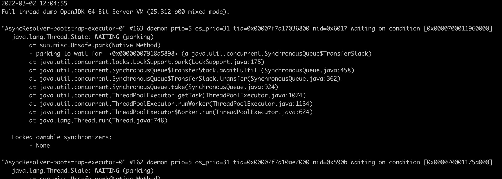
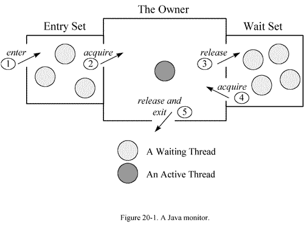

https://docs.oracle.com/javase/8/docs/technotes/tools/unix/jstack.html

```shell
jps -l

jstack [ option ] pid
jstack [ option ] executable core
jstack [ option ] [server-id@]remote-hostname-or-IP

```

1）options： 

executable Java executable from which the core dump was produced
core dump
remote-hostname-or-IP 远程 debug 服务的主机名或 ip
server-id 唯一id，假如一台主机上多个远程 debug 服务 


2）基本参数：

-F 当 jstack [-l] pid 强制打印栈信息
-l 打印列表，打印关于锁的附加信息
-m 打印 java 和native c/c++ 框架的所有栈信息
-h -help 

e.g.
```
jstack -l 76589 > 76589.txt
```
This will generate a file called jstack-output.txt. Alternatively kill -3 <pid> can be used on Linux or Ctrl + Break in the console in Windows.



* "AsyncResolver-bootstrap-executor-0"：线程名
* "#163"：线程编号
* "daemon"：后台守护线程
* "prio=5"：优先级
* "os_prio=31"：操作系统优先级
* "tid=0x00007f7a17036800"：线程id
* "nid=0x6017"：比较关键，操作系统映射的线程id（十六进制）, 转成十进制后，对应Linux下ps -mp pid -o THREAD,tid,time命令打印出来的线程tid
* "0x0000700011960000"：线程栈的起始地址
* "RUNNABLE"：一种线程状态

线程的状态:

* NEW：新建，线程创建后还未启动，还没调用start方法
* RUNNABLE：运行，处于可运行状态，正在运行或准备运行
* BLOCKED：阻塞，线程挂起，等待获取锁
* WAITING：无限期等待，线程无限期地等待另一个线程执行特定操作
* TIMED_WAITING：有限期等待，线程正在等待另一个线程执行最多指定等待时间的操作
* TERMINATED：线程终止状态


Monitor

在多线程的 JAVA程序中，实现线程之间的同步，就要说说 Monitor。 Monitor是 Java中用以实现线程之间的互斥与协作的主要手段，它可以看成是对象或者 Class的锁。每一个对象都有，也仅有一个 monitor。下 面这个图，描述了线程和 Monitor之间关系，以 及线程的状态转换图：




进入区(Entrt Set):表示线程通过synchronized要求获取对象的锁。如果对象未被锁住,则迚入拥有者;否则则在进入区等待。一旦对象锁被其他线程释放,立即参与竞争。

拥有者(The Owner):表示某一线程成功竞争到对象锁。

等待区(Wait Set):表示线程通过对象的wait方法,释放对象的锁,并在等待区等待被唤醒。

从图中可以看出，一个 Monitor在某个时刻，只能被一个线程拥有，该线程就是 “Active Thread”，而其它线程都是 “Waiting Thread”，分别在两个队列 “ Entry Set”和 “Wait Set”里面等候。在 “Entry Set”中等待的线程状态是 “Waiting for monitor entry”，而在“Wait Set”中等待的线程状态是 “in Object.wait()”。 先看 “Entry Set”里面的线程。我们称被 synchronized保护起来的代码段为临界区。当一个线程申请进入临界区时，它就进入了 “Entry Set”队列。对应的 code就像：

```
synchronized (obj) {
    ...
}
```

调用修饰

表示线程在方法调用时,额外的重要的操作。线程Dump分析的重要信息。修饰上方的方法调用。

* locked <地址> 目标：使用synchronized申请对象锁成功,监视器的拥有者。
* waiting to lock <地址> 目标：使用synchronized申请对象锁未成功,在迚入区等待。
* waiting on <地址> 目标：使用synchronized申请对象锁成功后,释放锁幵在等待区等待。
* parking to wait for <地址> 目标


线程动作

线程状态产生的原因

* runnable:状态一般为RUNNABLE。
* in Object.wait():等待区等待,状态为WAITING或TIMED_WAITING。
* * waiting for monitor entry:进入区等待,状态为BLOCKED。
waiting on condition:等待区等待、被park。
* sleeping:休眠的线程,调用了Thread.sleep()。


